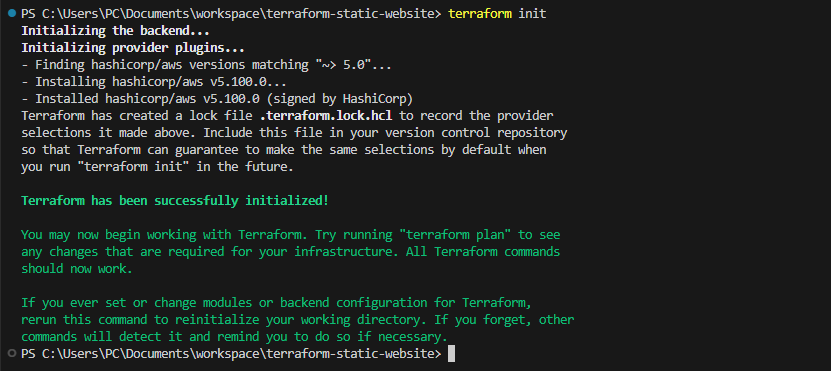
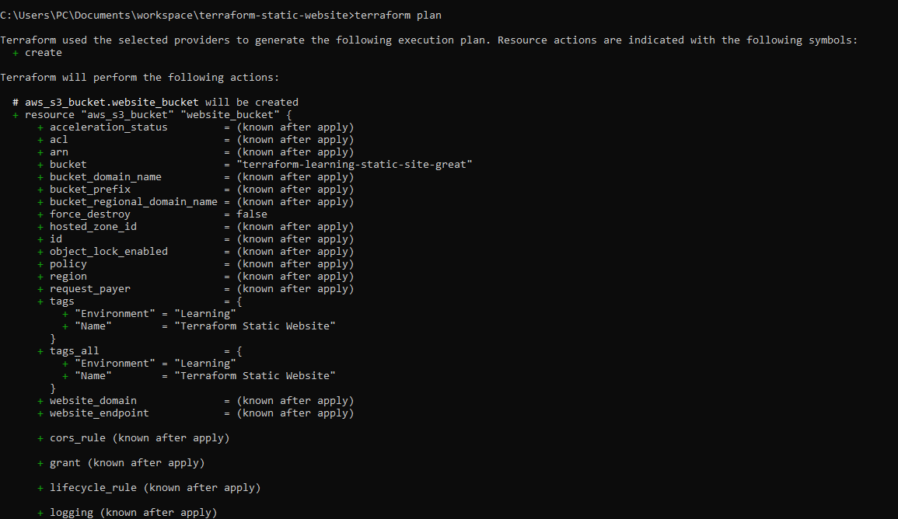
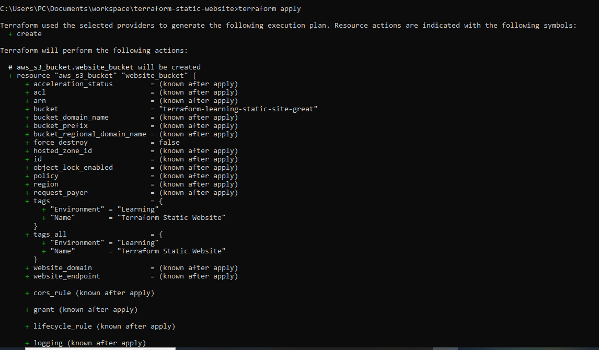
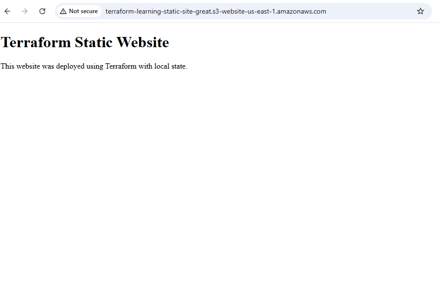
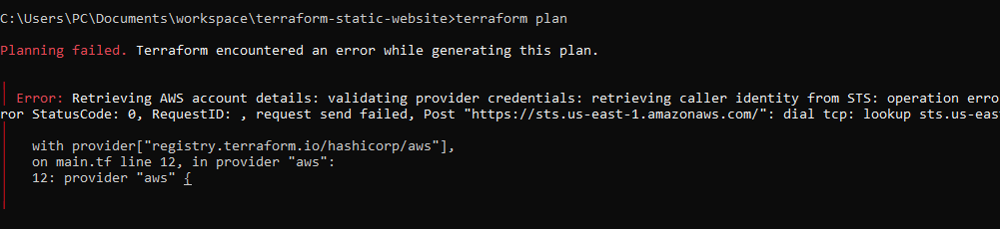
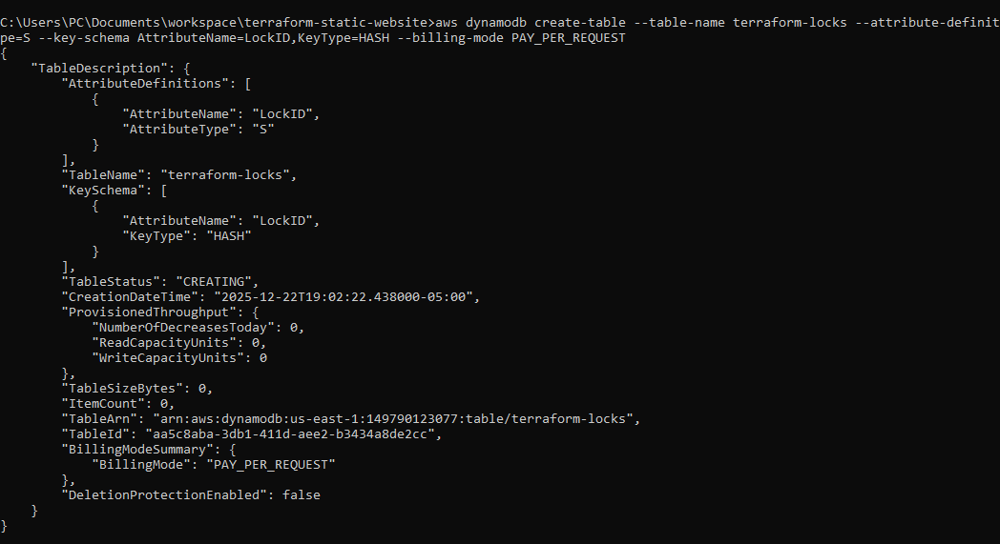
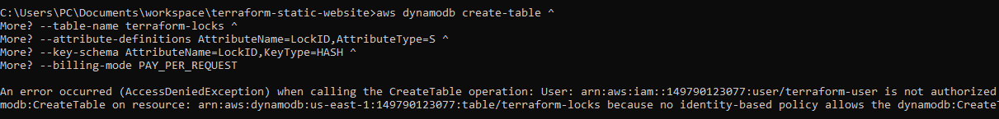
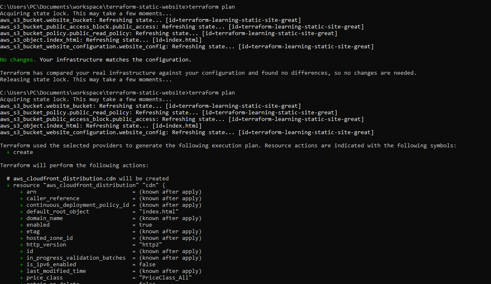
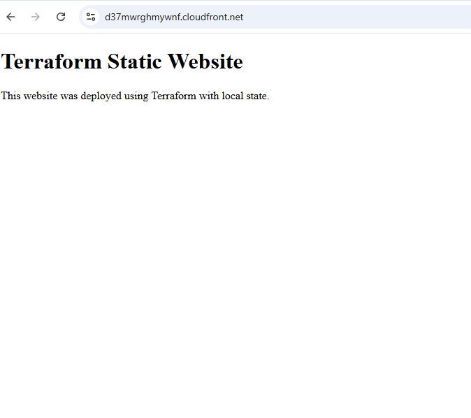

# Terraform Static Website Implementation

### Project Overview
Deploy a static website using Terraform and AWS S3.Use Terraform to provision S3 bucket, host HTML content, and optionally add CloudFront CDN

### Prerequisites

 - Terraform installed locally.

 - AWS CLI configured (aws configure).

 - Basic knowledge of HCL (Terraform syntax).

 - Text editor (VS Code, Sublime, etc.).


## 1. Project Setup
-  I created a project directory:
```bash
mkdir terraform-static-website && cd terraform-static-website
```
- I verified that Terraform was installed by running `terraform -version` and AWS CLI by running `aws --version`.
- I configured AWS credentials using `aws configure`.

- I created a `main.tf` file with Terraform and AWS provider configuration:

```hcl
terraform {
  required_version = ">= 1.0.0"
  required_providers {
    aws = {
      source  = "hashicorp/aws"
      version = "~> 5.0"
    }
  }
}

provider "aws" {
  region = "us-east-1"
}
```

- I initialized Terraform:

```bash
terraform init
```

### I added screenshots



---

## 2. Define Infrastructure
- I defined an S3 bucket, website configuration, bucket policy, and public access block in `main.tf`.
- I added inline HTML for `index.html` directly in Terraform.

---

## 3. Deployment & Validation
- I ran:

```bash
terraform plan
terraform apply -auto-approve
```

- Deployment succeeded, creating:
  - `aws_s3_bucket.website_bucket`
  - `aws_s3_bucket_public_access_block.public_access`
  - `aws_s3_bucket_policy.public_read_policy`
  - `aws_s3_bucket_website_configuration.website_config`
  - `aws_s3_object.index_html`


### I added screenshots





**Error encountered:** Initially `terraform plan` failed when using Phone hotspot due to STS endpoint resolution; switching to a stable internet connection resolved it.

### I added screenshots


---

## 4. State Management
- I configured Terraform local state (`terraform.tfstate`).
- When attempting remote state using DynamoDB for locking, I encountered:

```text
AccessDeniedException: User not authorized to perform: dynamodb:CreateTable
```
### I added screenshots



- I had issues releasing the lock, as I did not have permissions to delete items from the DynamoDB table.

### I added screenshots



---

## 5. CDN (CloudFront) Setup
- I added a CloudFront distribution in `main.tf` for the S3 bucket.

### I added screenshots



---

## Summary
- I successfully deployed a static website on S3 with local state management using Terraform.
- I attempted CloudFront setup and remote state but encountered permission errors due to IAM user restrictions.
- I configured GitHub to ignore Terraform binaries and local state.
- I documented all steps, commands, and errors encountered.

