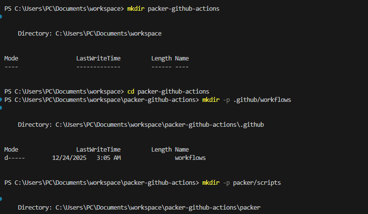
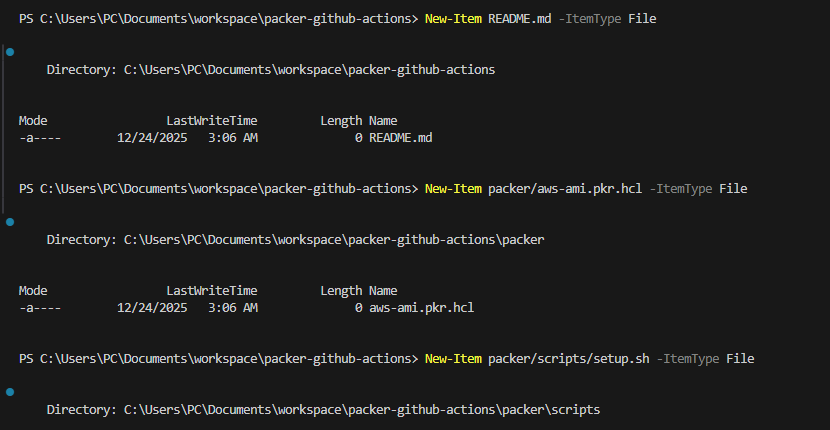
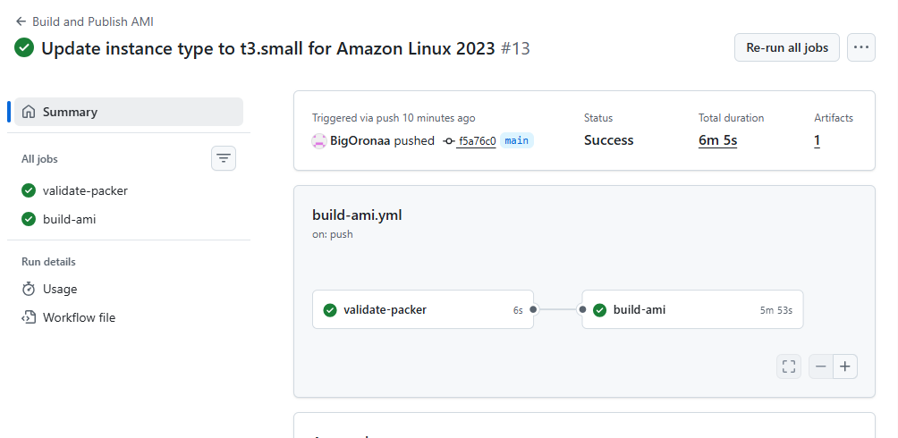
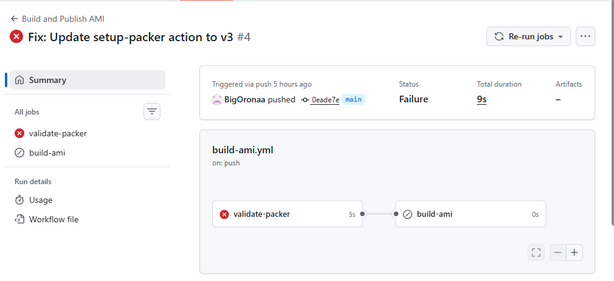
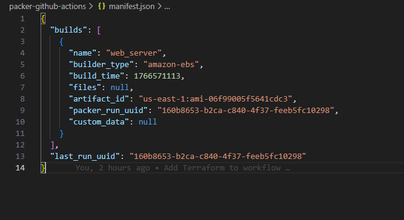
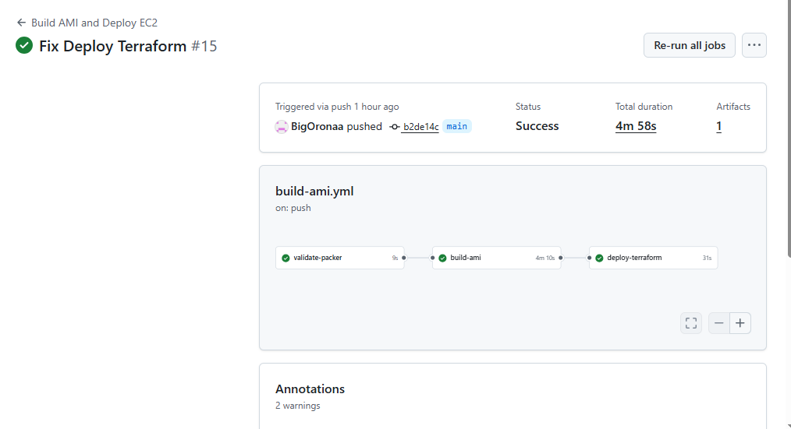
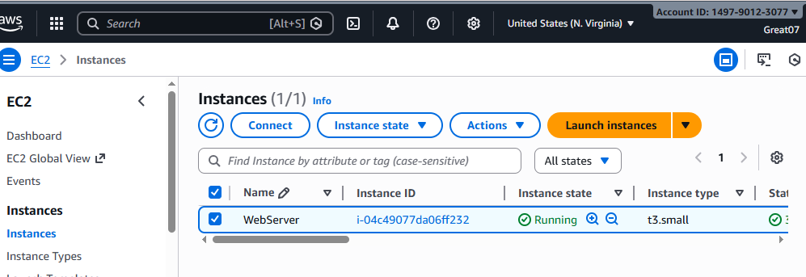
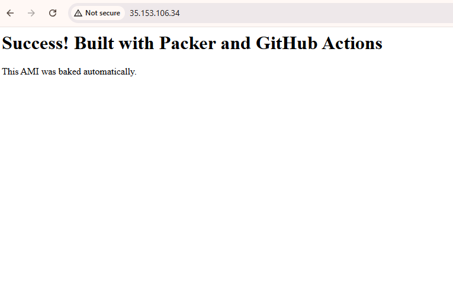
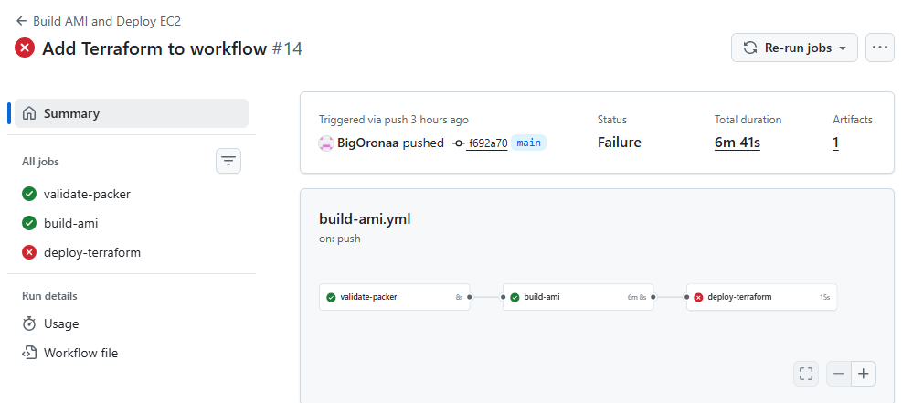

## Automated AMI Build with Packer and Deployment with Terraform

---

## Project Overview

In this project, I implemented an automated workflow that builds a custom Amazon Machine Image (AMI) using **Packer**, validates and builds it through **GitHub Actions**, and then deploys an EC2 instance using **Terraform** by referencing the AMI created by Packer.

The goal of this project was to demonstrate Infrastructure as Code (IaC), CI/CD automation, and proper separation of image creation (Packer) from infrastructure deployment (Terraform).

---

##  Tools and Technologies Used

- **AWS (EC2, AMI)**
- **Packer**
- **Terraform**
- **GitHub Actions**
- **Amazon Linux**
- **Shell scripting (provisioning)**

---

##  Project Structure

```
.
├── .github/workflows/
│   └── build-ami.yml
├── packer/
│   ├── aws-ami.pkr.hcl
│   ├── scripts/
│   │   └── setup.sh
│   └── manifest.json
├── terraform/
│   └── main.tf
└── README.md
```

---

##  Implementation Steps

### Step 1: Repository Setup

I created a GitHub repository and organized it into two main directories:
- `packer/` for AMI creation
- `terraform/` for EC2 deployment

This separation ensured clarity between image building and infrastructure provisioning.

### I added screenshots


---

### Step 2: Writing the Packer Configuration

I created a `packer` directory in the repository and added the main Packer template file `aws-ami.pkr.hcl`. In this file, I defined the required Amazon plugin, input variables, and the Amazon EBS builder configuration. I configured Packer to use Amazon Linux as the source AMI, specified the AWS region, and set the instance type that would be used temporarily during the AMI build process. I also added meaningful tags such as `PackerBuild = true` so the AMI could later be discovered by Terraform.

Next, I wrote a shell provisioner script (`scripts/setup.sh`) that installs and configures NGINX on the instance. This script runs during the Packer build and ensures that every AMI produced already contains a fully configured web server.


### I added screenshots


---

### Step 3: GitHub Actions – Packer CI Pipeline

I implemented a GitHub Actions workflow to automate the AMI build process.

What I did:
- I configured the workflow to trigger on pushes to the `main` branch.
- I added a validation job to run `packer init` and `packer validate`.
- I added a build job to run `packer build`.
- I securely configured AWS credentials using GitHub secrets.
- I uploaded the generated `manifest.json` as a build artifact.


### I added screenshots



**Error encountered:**
- AWS rejected the EC2 launch request with an error stating that the selected instance type was not eligible for the Free Tier. This caused the AMI build job to fail and no artifact was created.
I fixed this by updating the `instance_type` variable in `aws-ami.pkr.hcl` to `t3.small`, which is supported for the chosen Amazon Linux AMI.


### I added screenshots



---

### Step 5: AMI Build Verification

After the workflow ran successfully:
- I confirmed the AMI was created in **us-east-1**.
- I verified the AMI ID using the generated `manifest.json`.
- I confirmed the AMI had the correct tags applied.

### I added screenshots



---

### Step 6: Referencing the Packer AMI in Terraform

I created a Terraform configuration that dynamically references the AMI built by Packer.

What I implemented:
- I used a `data "aws_ami"` block to fetch the most recent AMI.
- I filtered the AMI using the tag `PackerBuild = true`.
- I ensured Terraform always deploys the latest AMI created by Packer.

---

### Step 7: Deploying EC2 with Terraform

I created an EC2 instance using Terraform.

Actions taken:
- I deployed an EC2 instance using the Packer-built AMI.
- I matched the instance type with the one used during AMI creation.
- I created a security group allowing SSH (22) and HTTP (80).
- I output the public IP of the instance for verification.


### I added screenshots





**Error encountered:**
- Terraform failed due to a reference to an undeclared `aws_vpc.default` resource. I fixed by removing the undeclared VPC reference and relied on the default VPC. After fixing the configuration, the Terraform deployment succeeded.

### I added screenshots



---

##  Final Outcome

- Automated AMI creation with Packer
- CI/CD pipeline using GitHub Actions
- Dynamic AMI reference in Terraform
- Successful EC2 deployment
- Clean separation of concerns between Packer and Terraform

---

##  Conclusion

This project demonstrates my ability to design and implement a complete Infrastructure as Code workflow, automate cloud image creation, troubleshoot CI/CD issues, and deploy cloud infrastructure using industry-standard tools.


**PackerGithub Repo** I created a repo that all the github action ran. 
### Link to the repo: [https://github.com/BigOronaa/packer-github-actions](https://github.com/BigOronaa/packer-github-actions)