# Multi-Cloud Kubernetes Deployment Project Documentation

## Project Overview
I implemented a multi-cloud Kubernetes setup using Terraform modules to deploy clusters on AWS (EKS) and GCP (GKE). I also deployed a sample NGINX application to validate the setup. Azure (AKS) was planned but not implemented due to account limitations.

The goals were:
- Use reusable Terraform modules for each cloud provider.
- Deploy Kubernetes clusters.
- Deploy a sample application (NGINX) on each cluster.
- Validate cluster operations.
- Plan for interconnecting clusters (VPN/VPC peering).

---

## Step 1: Project Structure

I started by creating the project root folder and organizing it as follows:

```
multi-cloud-k8s/
├── environments/
│   ├── dev/
│   │   └── main.tf
├── modules/
│   ├── aws-eks/
│   │   └── main.tf
│   ├── gcp-gke/
│   │   └── main.tf
│   └── azure-aks/  (planned, not implemented)
├── deployment.yaml
├── service.yaml
```

- `environments/dev/` contained environment-specific Terraform configurations.
- `modules/` contained reusable modules for each cloud provider.

### I added Screenshots
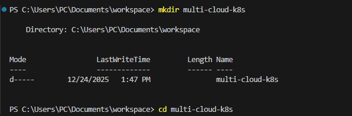
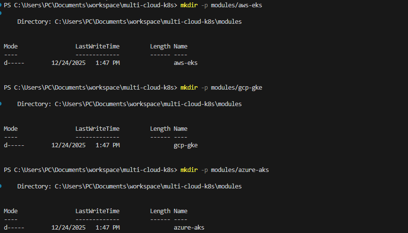
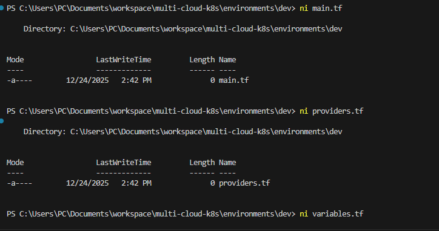


---

## Step 2: AWS EKS Deployment

1. I created the `aws-eks` Terraform module (`modules/aws-eks/main.tf`) to deploy:
   - VPC and subnets
   - IAM roles for cluster and nodes
   - EKS cluster
   - EKS Node Group

### I added Screenshots
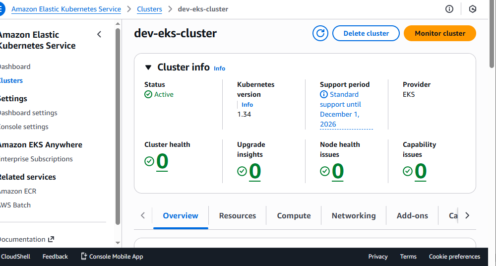


2. I configured the `environments/dev/main.tf` to use the AWS module:

```hcl
module "aws_eks" {
  source = "../../modules/aws-eks"
  cluster_name = "dev-eks-cluster"
  region       = var.aws_region
  subnet_ids   = ["subnet-00d269bfe2a5c17f7", "subnet-0ebd983bc68309e5b"]
}
```

3. I initialized Terraform and applied the configuration:

```powershell
terraform init
terraform apply
```


### I added Screenshots
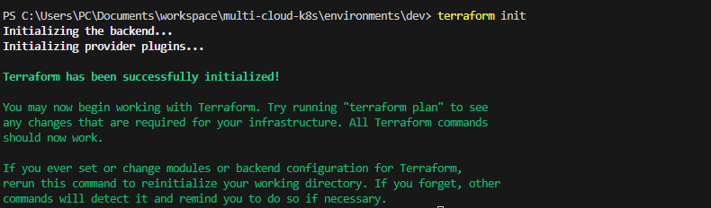
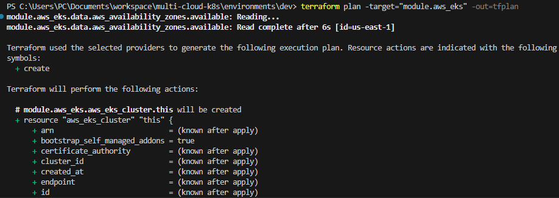
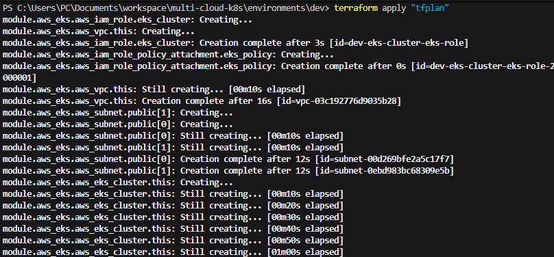


---

## Step 3: GCP GKE Deployment

1. I created the `gcp-gke` Terraform module (`modules/gcp-gke/main.tf`) to deploy:
   - Regional GKE cluster
   - Node pool configuration

### I added Screenshots
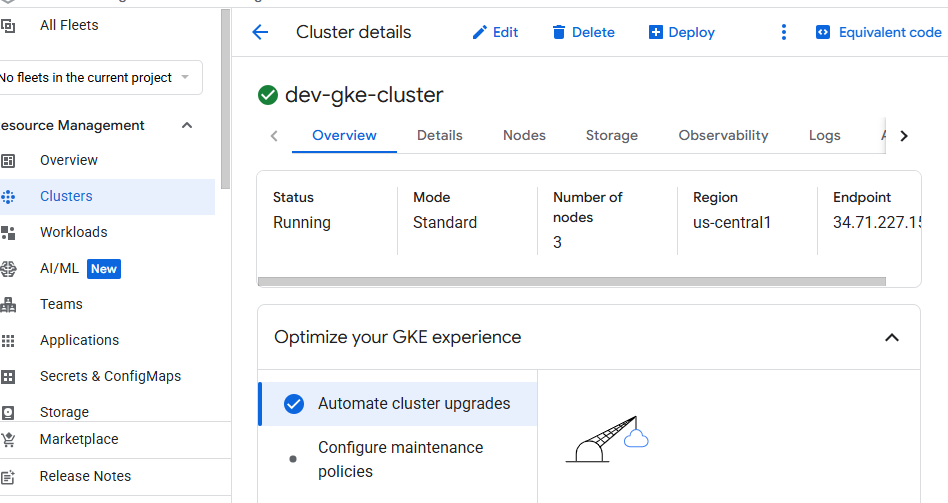

2. I configured the environment to use the GCP module:

```hcl
module "gcp_gke" {
  source           = "../../modules/gcp-gke"
  gcp_project_id   = var.gcp_project_id
  gcp_region       = var.gcp_region
  gke_cluster_name = "dev-gke-cluster"
  gke_node_count   = 1
  gke_machine_type = "e2-medium"
  gke_disk_size_gb = 50
}
```

3. I initialized Terraform and applied the configuration. The cluster was successfully created:

```powershell
gcloud container clusters get-credentials dev-gke-cluster --region us-central1
kubectl get nodes -o wide
NAME                                             STATUS   ROLES   AGE
gke-dev-gke-cluster-default-pool-3a33dba5-k09z  Ready    <none>  17h
gke-dev-gke-cluster-default-pool-fe30095f-xhgs  Ready    <none>  17h
```

### I added Screenshots
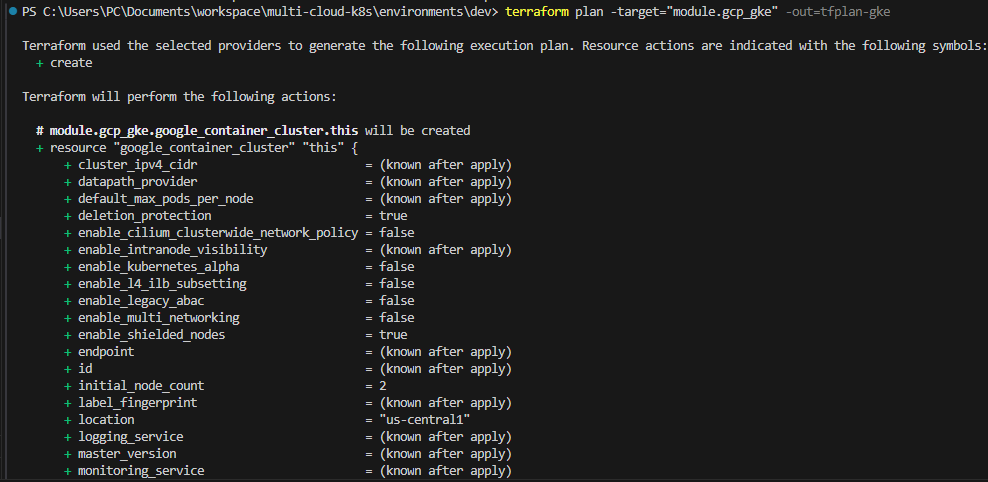
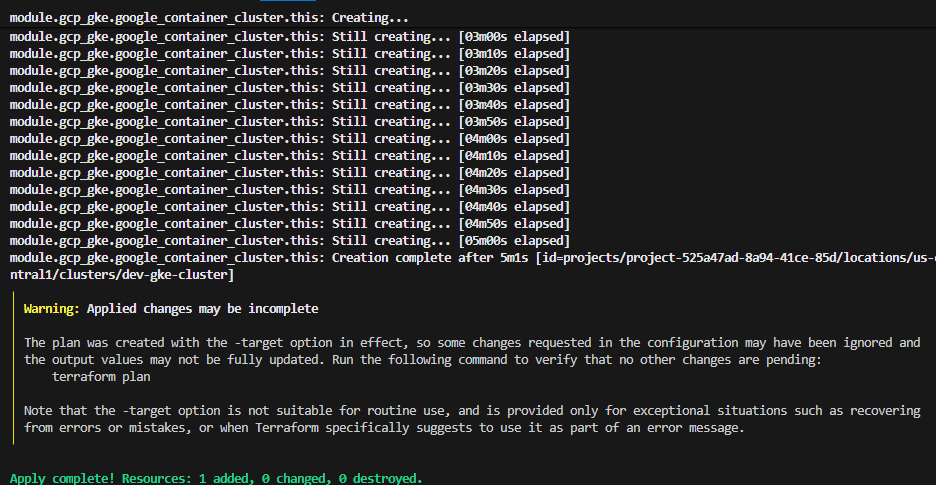

---

## Step 4: Deploy NGINX Application

1. I created `deployment.yaml` and `service.yaml` for NGINX:

- **deployment.yaml**

```yaml
apiVersion: apps/v1
kind: Deployment
metadata:
  name: nginx-deployment
spec:
  replicas: 2
  selector:
    matchLabels:
      app: nginx
  template:
    metadata:
      labels:
        app: nginx
    spec:
      containers:
      - name: nginx
        image: nginx:latest
        ports:
        - containerPort: 80
```

- **service.yaml**

```yaml
apiVersion: v1
kind: Service
metadata:
  name: demo-app-service
spec:
  selector:
    app: nginx
  type: LoadBalancer
  ports:
  - port: 80
    targetPort: 80
```

2. I applied the manifests to both clusters:

```powershell
kubectl apply -f deployment.yaml
kubectl apply -f service.yaml
kubectl get pods
kubectl get svc
```

### I added Screenshots
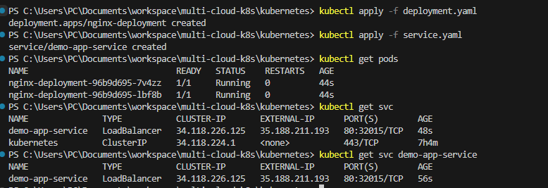

3. **Validation**:
   - AWS EKS NGINX service:

```
EXTERNAL-IP: a796be1bb6997444c937e20a6a25827c-1114439536.us-east-1.elb.amazonaws.com
```

   - GCP GKE NGINX service:

```
EXTERNAL-IP: 35.188.211.193
```

### I added Screenshots
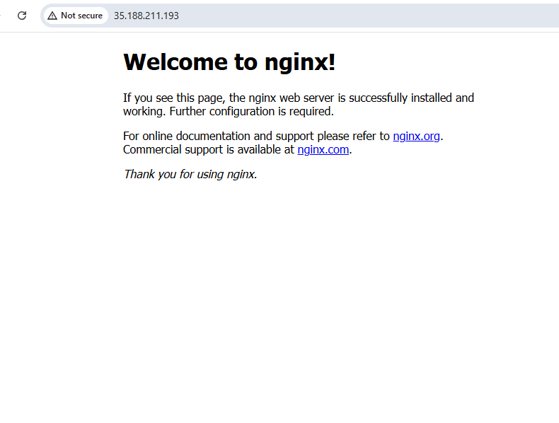
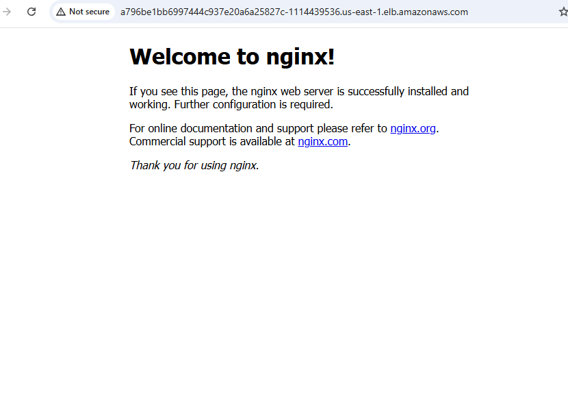

4. Both clusters successfully ran the NGINX pods, confirming the deployments.


### I added Screenshots
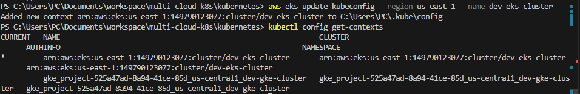

---

## Step 5: Azure AKS (Planned)

- I attempted to set up AKS but was blocked due to tenant inactivity and lack of eligibility for a free account.
- Commands that would have been used:

```powershell
az aks get-credentials --resource-group dev-aks-rg --name dev-aks-cluster
kubectl config use-context <aks-context-name>
kubectl get nodes
```

- Azure AKS deployment was skipped for now.

---

## Step 6: Interconnect Clusters (Planned)

- The next step was to set up VPN or VPC peering between AWS EKS and GCP GKE clusters for cross-cluster communication.
- Due to potential cloud costs and complexity, this step was **not executed**, but the plan would involve creating a reusable Terraform module for VPN/VPC peering.

### I added Screenshots
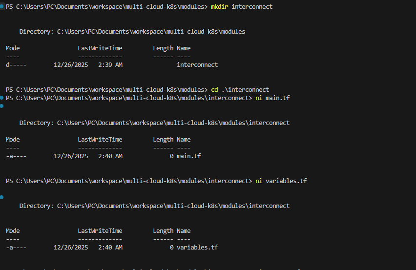

---

## Conclusion

- I created reusable Terraform modules for AWS and GCP Kubernetes clusters.
- I deployed a sample NGINX application on both clusters.
- I validated that nodes are `Ready` and services are externally reachable.
- Azure AKS deployment and inter-cluster networking are planned but pending due to account limitations and cost considerations.

