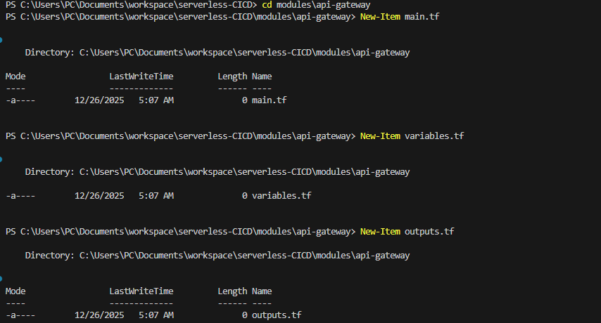
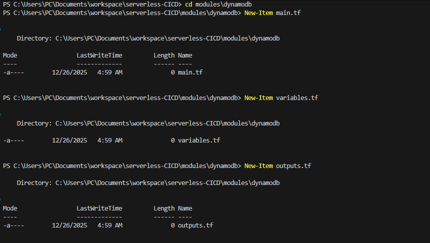
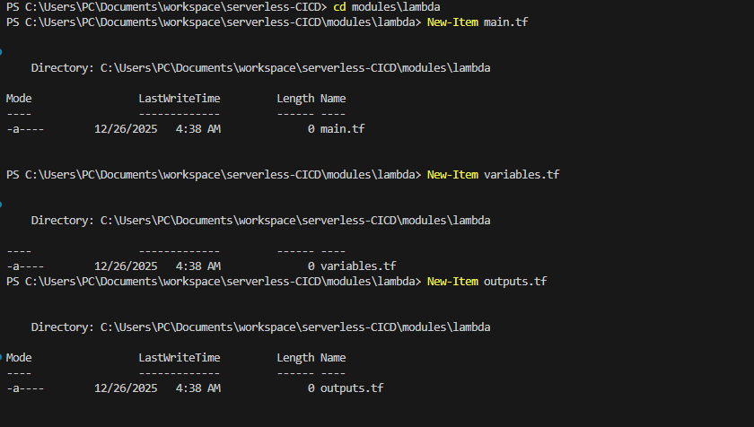
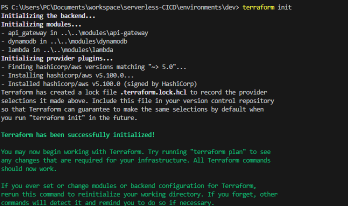
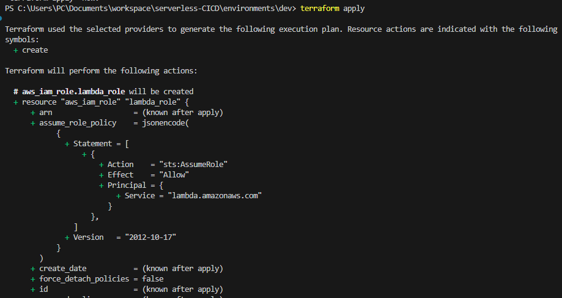
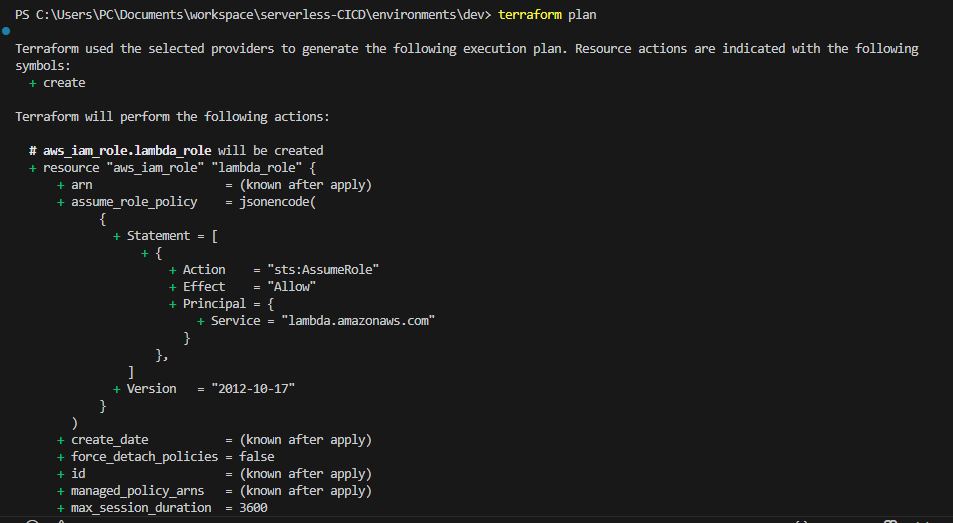
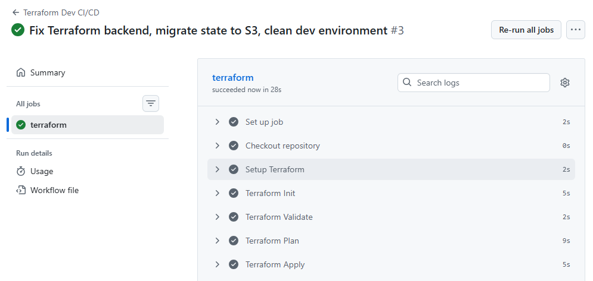
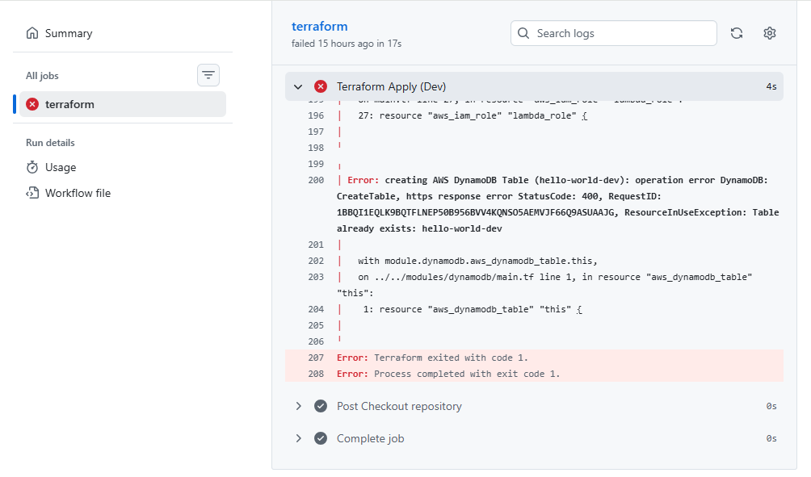
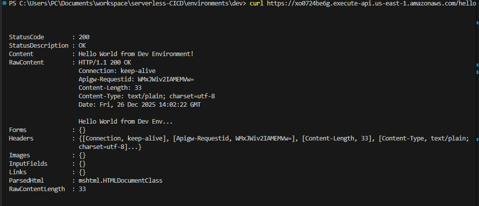
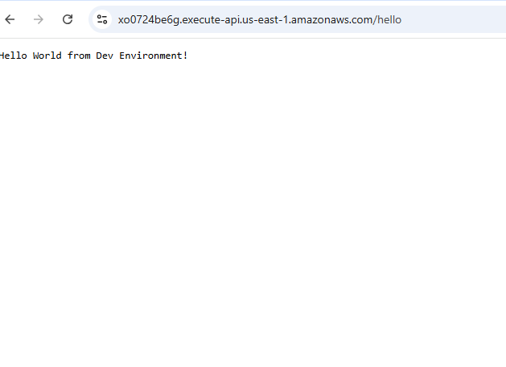

#  Serverless Application with CI/CD Pipeline Project

## Project Overview
This project involves creating a serverless application on AWS using Terraform for infrastructure provisioning and GitHub Actions for CI/CD. The stack includes:
- AWS Lambda
- API Gateway
- DynamoDB

The environment used is `dev`. Staging and prod are not implemented in this submission.

## Project Structure

```
serverless-CICD/
├── modules/
│   ├── lambda/
│   ├── api-gateway/
│   └── dynamodb/
├── environments/
│   ├── dev/
│   ├── staging/
│   └── prod/
└── .github/
    └── workflows/
        └── terraform-dev.yml
```


## Implementation Steps

### 1. Initial Project Setup
I created the root project folder `serverless-CICD` and set up subfolders for modules (`lambda`, `api-gateway`, `dynamodb`) and environments (`dev`).


### I added Screenshots





### 2. Terraform Configuration
- I configured Terraform providers and required versions in `main.tf`.
- I created reusable modules for Lambda, API Gateway, and DynamoDB with variables and outputs.
- I set up the AWS provider using `var.region` and environment variable overrides.


### 3. Dev Environment Setup
- I configured `environments/dev/main.tf` to use the modules.
- I added resources:
  - IAM Role for Lambda
  - Lambda function
  - API Gateway
  - DynamoDB table
- I passed necessary variables like `TABLE_NAME` to Lambda environment.


### 4. Initial Terraform Run
- I ran `terraform init` and `terraform plan`.
- Encountered errors due to pre-existing resources:
  - `IAM Role already exists`
  - `DynamoDB Table already exists`
- Recognized that S3 backend and remote state need configuration.

### I added Screenshots





### 5. Terraform Backend Setup
- I configured S3 backend with:
  ```hcl
  backend "s3" {
    bucket = "terraform-state-great-learning"
    key    = "serverless/dev/terraform.tfstate"
    region = "us-east-1"
    encrypt = true
  }
  ```
- Migrated state from local to S3 backend.
- Ran `terraform init -reconfigure` and confirmed successful state migration.


### 7. GitHub Actions CI/CD
- Created `.github/workflows/terraform-dev.yml` to automate Terraform deployment for dev environment:
  - Checkout repository
  - Setup Terraform
  - Terraform Init
  - Terraform Validate
  - Terraform Plan & Apply
  - I added secrets to AWS credentials on the repo

### I added Screenshots




- Initially, the pipeline was stuck due to backend misconfiguration.
- After fixing the S3 backend and migrating state, the pipeline completed successfully.

### I added Screenshots



### 8. Validation
- Accessed the deployed Lambda via API Gateway:
  ```powershell
  curl https://xo0724be6g.execute-api.us-east-1.amazonaws.com/hello
  ```
  Output: `Hello World from Dev Environment!`
- Verified all resources were correctly created and managed by Terraform.

### I added Screenshots




### 9. Final Status
- Terraform state fully migrated to S3.
- Dev environment resources created and in sync.
- CI/CD pipeline runs successfully on `main` branch pushes.

---


**serverless-CICD Repo** I created a repo that all the github action ran. 
### Link to the repo: [https://github.com/BigOronaa/serverless-CICD](https://github.com/BigOronaa/serverless-CICD)

