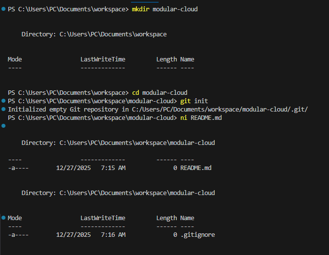
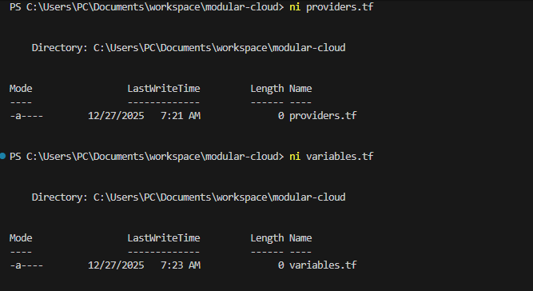
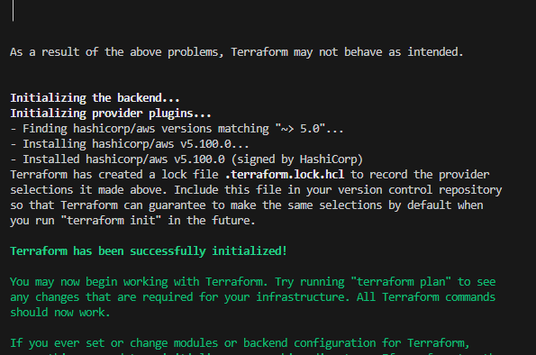
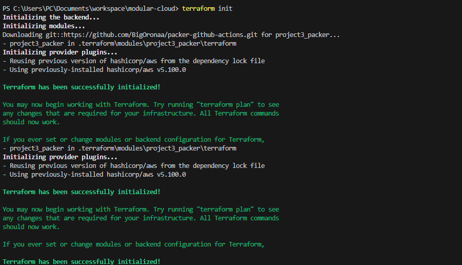
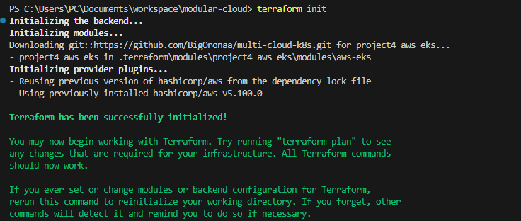
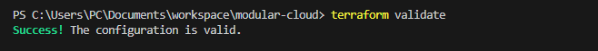
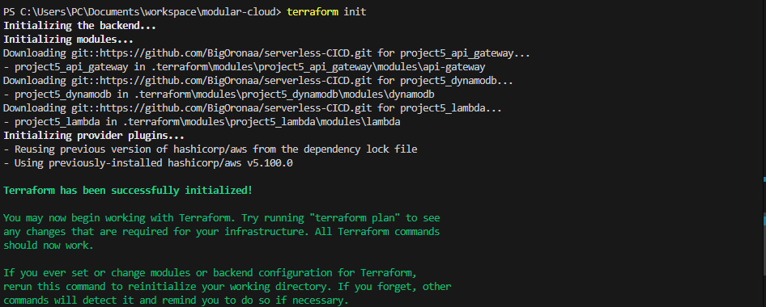

# Project 6 Implementation Documentation — Modular Cloud

## Introduction
This document details the **step-by-step implementation of Project 6 (Modular Cloud)**, showing how I orchestrated infrastructure from previous projects (3, 4, and 5) using Terraform modular infrastructure.

---

## Step 1: Set Up Project Directory
I created a new directory for Project 6 called `modular-cloud`:

```powershell
mkdir modular-cloud
cd modular-cloud
```

I initialized a Git repository to track my files:

```powershell
git init
```

### I added Screenshots


---

## Step 2: Configure Terraform Provider
I created a `providers.tf` file and configured the AWS provider:

```hcl
terraform {
  required_providers {
    aws = {
      source  = "hashicorp/aws"
      version = "~> 5.100"
    }
  }
  backend "local" {}
}

provider "aws" {
  region = "us-east-1"
}
```

### I added Screenshots


---

## Step 3: Initialize Terraform
I ran the following command to initialize Terraform and download provider plugins:

```powershell
terraform init
```

### I added Screenshots


---

## Step 4: Integrate Project 3 Module (Packer Infrastructure)
I added a module block in `main.tf` to integrate Project 3:

```hcl
module "project3_packer" {
  source     = "git::https://github.com/BigOronaa/packer-github-actions.git"
  aws_region = var.aws_region
}
```
### I added Screenshots


I then ran:

```powershell
terraform validate
```

### I added Screenshots


---

## Step 5: Integrate Project 4 Module (AWS EKS Cluster)
I added a module block for Project 4 in `main.tf`:

```hcl
module "project4_aws_eks" {
  source             = "git::https://github.com/BigOronaa/multi-cloud-k8s.git//modules/aws-eks"
  cluster_name       = "project4-eks-cluster"
  region             = "us-east-1"
  node_instance_type = "t3.medium"
  subnet_ids         = ["subnet-0123456789abcdef0", "subnet-0fedcba9876543210"]
}
```

I validated the configuration:

```powershell
terraform validate
```

### I added Screenshots


---

## Step 6: Integrate Project 5 Modules (Serverless CI/CD)
I added module blocks for Lambda, DynamoDB, and API Gateway in `main.tf`.

### Lambda Module
```hcl
module "project5_lambda" {
  source = "git::https://github.com/BigOronaa/serverless-CICD.git//modules/lambda"

  function_name         = "project5-function"
  runtime               = "python3.11"
  handler               = "app.lambda_handler"
  filename              = "lambda/lambda.zip"
  role_arn              = "arn:aws:iam::123456789012:role/lambda-execution-role"
  environment_variables = {
    ENV = "dev"
  }
}
```

### DynamoDB Module
```hcl
module "project5_dynamodb" {
  source = "git::https://github.com/BigOronaa/serverless-CICD.git//modules/dynamodb"

  table_name = "project5-table"
  hash_key   = "id"
}
```

### API Gateway Module
```hcl
module "project5_api_gateway" {
  source = "git::https://github.com/BigOronaa/serverless-CICD.git//modules/api-gateway"

  api_name             = "project5-api"
  lambda_invoke_arn    = module.project5_lambda.invoke_arn
  lambda_function_name = module.project5_lambda.lambda_function_name
  route_key            = "GET /"
  stage_name           = "dev"
}
```

I validated the full configuration:

```powershell
terraform validate
```

### I added Screenshots


---

## Step 7: Final Checks

I ran `terraform validate` one last time to confirm all modules are correctly wired.

### I added Screenshots


---

## Conclusion
I successfully orchestrated Projects 3, 4, and 5 into Project 6 using **Terraform modular infrastructure**. This implementation demonstrates:

- Module reuse and orchestration
- Cross-project dependency management
- Scalable and maintainable infrastructure provisioning


