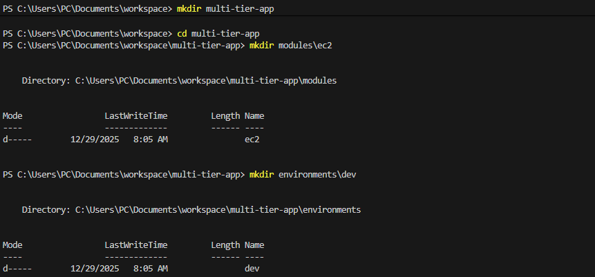
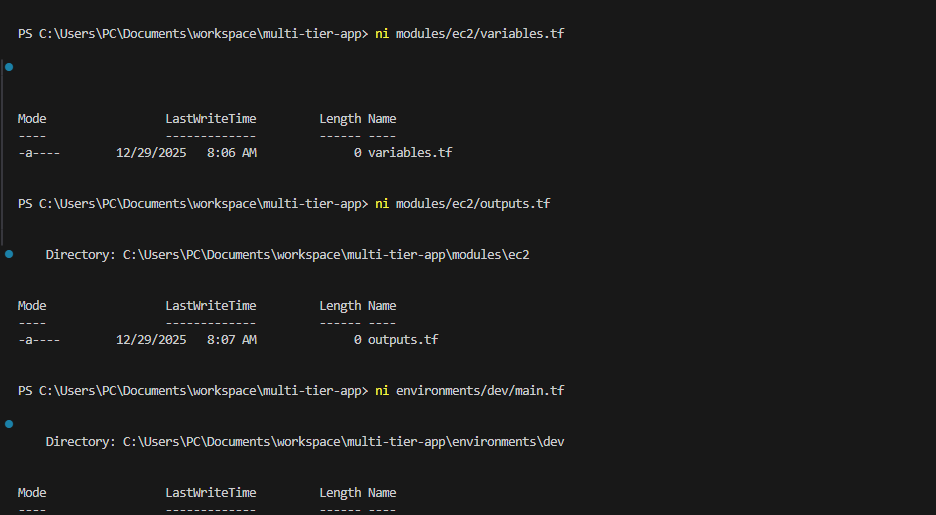
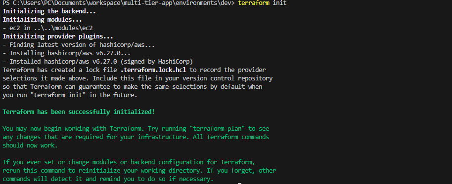
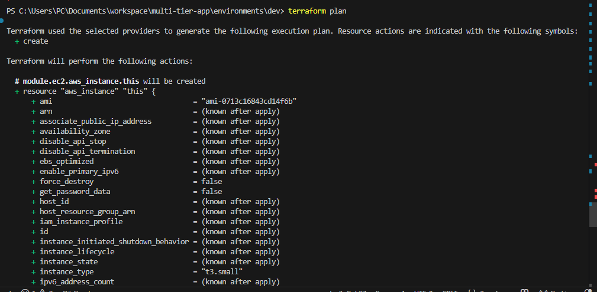
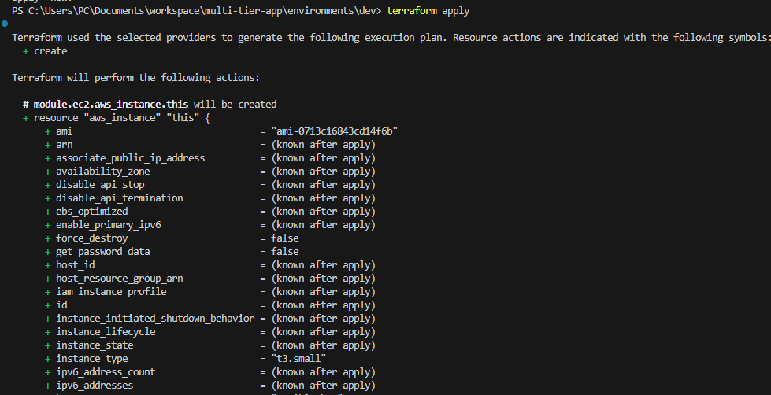
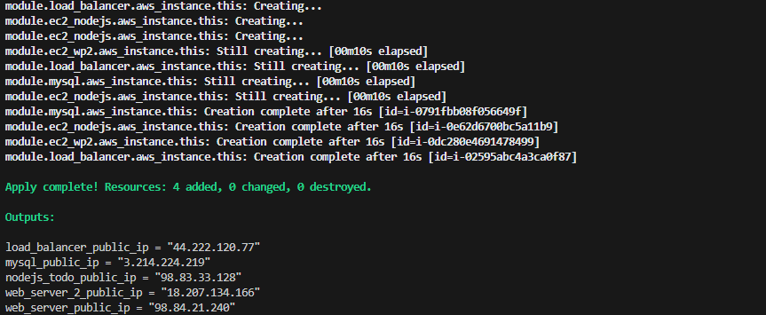
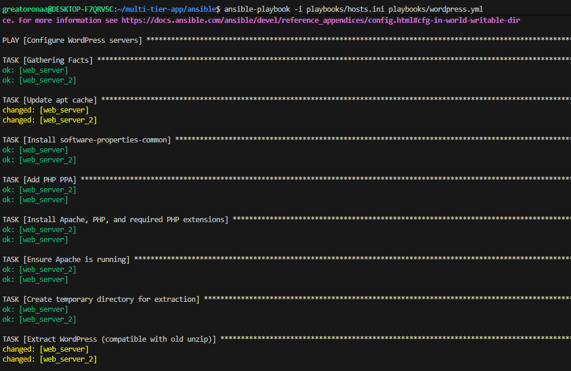
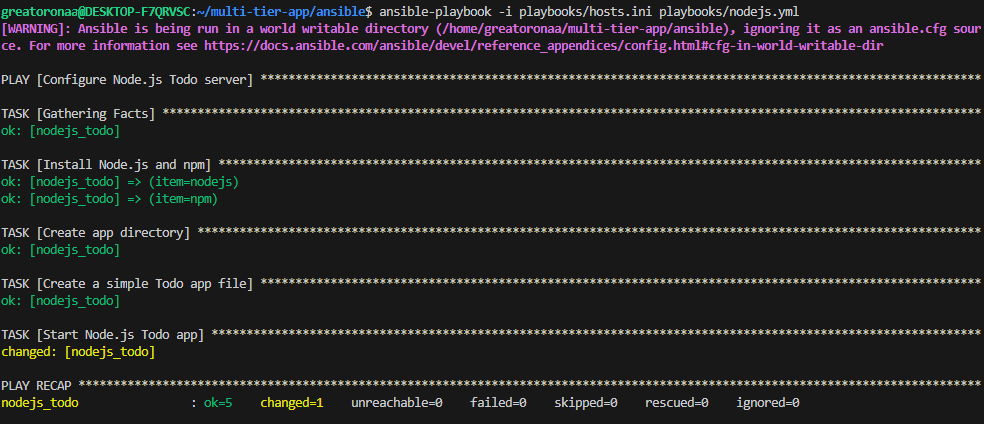
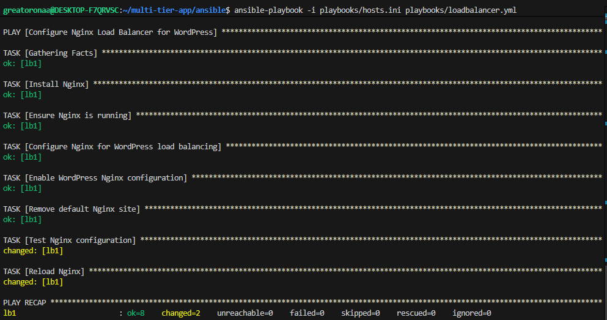
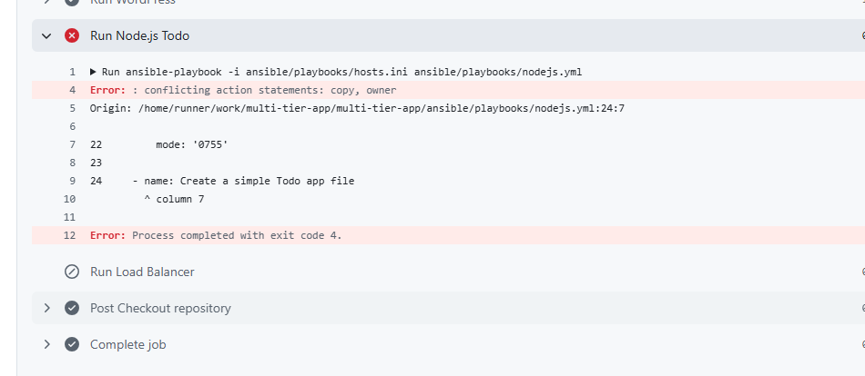

# Implementation Documentation

# Multi-Tier Web Application Deployment Project

## Introduction
This document provides a step-by-step record of the implementation of a multi-tier web application using Terraform and Ansible. The instructions are written in the first person, describing what I did throughout the project.

## Steps Implemented

### 1. Terraform Infrastructure Provisioning
- I created a Terraform root folder with environments and modules.

### I Added Screenshots

- I defined the infrastructure required for:
  - **Two WordPress web servers**
  - **One Node.js Todo application server**
  - **One MySQL database server running in Docker**
  - **One Nginx load balancer**
- I configured AWS resources including EC2 instances, security groups, and networking.
- I ran `terraform init` to initialize the configuration.
- I applied the configuration using `terraform apply` to provision all resources.

### I Added Screenshots

- The 5 instances was created after the terraform automation ran
### I Added Screenshots

### 2. Ansible PLaybook

#### Web Servers (WordPress)
- I created an Ansible playbook to:
  - Update apt cache
  - Install `software-properties-common`
  - Add PHP PPA
  - Install Apache, PHP, and required PHP extensions
  - Ensure Apache service is running
  - Download the latest WordPress zip
  - Extract WordPress into a temporary directory
  - Copy WordPress files to `/var/www/html`
  - Create `wp-config.php` with database credentials
  - Set ownership and permissions for web files
  - Restart Apache

### I Added Screenshots

#### Node.js Server
- I created an Ansible playbook to:
  - Install Node.js and npm
  - Create `/home/ubuntu/todo-app` directory
  - Create a simple `app.js` Todo application
  - Start the Node.js application using `nohup`

### I Added Screenshots

#### Load Balancer (Nginx)
- I created an Ansible playbook to:
  - Install Nginx
  - Configure Nginx for load balancing between WordPress web servers
  - Enable the WordPress site configuration
  - Remove the default Nginx site
  - Test the Nginx configuration and reload Nginx

### I Added Screenshots

#### Database Server (Docker MySQL)
- I created an Ansible playbook to:
  - Install Docker and Docker Compose
  - Pull MySQL Docker image
  - Start a MySQL container with the WordPress database and user

### I Added Screenshots

### Ansible CI
I created a .github/workflows/ansible.yml file and pushed to github.

### I Added Screenshots

**Error Encountered** It failed several times because of SSH and syntax on the YAML. i fixed it by adding the correct credentials to github.

### I Added Screenshots

###  Notes
- I followed consistent naming conventions for Terraform resources.
- I used first-person verbs in all steps to document my actions.
- I tested each playbook individually before integrating into the CI/CD workflow.
- I ensured all SSH keys and Ansible inventory configurations were correctly applied to the respective hosts.

**multi-tier-app Repo** I created a repo that all the Terraform and Ansible Actions ran. 
### Link to the repo: [https://github.com/BigOronaa/multi-tier-app](https://github.com/BigOronaa/multi-tier-app)
