# Building a Multi-Cloud Kubernetes Deployment using Terraform

## Project Overview

In this project, I designed and deployed a multi-cloud Kubernetes environment using reusable Terraform modules across AWS EKS and Google Kubernetes Engine (GKE). I also deployed and validated a sample NGINX application on both clusters to confirm cluster functionality and external connectivity.

The objective of this project was to:
- Build reusable Infrastructure-as-Code modules for multi-cloud Kubernetes deployments
- Provision and manage Kubernetes clusters on AWS and GCP
- Deploy and validate containerized workloads across environments
- Improve infrastructure consistency through modular Terraform design
- Explore future interconnectivity between cloud environments

Azure AKS integration was planned as part of the architecture but was not implemented due to Azure account limitations.

---

# Architecture Overview

```text
Terraform Modules
        │
 ┌──────┴──────┐
 │             │
AWS EKS     GCP GKE
 │             │
NGINX App   NGINX App
 │             │
LoadBalancer Services
```

---

# Project Structure

I organized the repository using a modular Terraform structure to separate reusable infrastructure code from environment-specific configurations.

```text
multi-cloud-k8s/
├── environments/
│   └── dev/
│       └── main.tf
├── modules/
│   ├── aws-eks/
│   │   └── main.tf
│   ├── gcp-gke/
│   │   └── main.tf
│   └── azure-aks/   (planned)
├── deployment.yaml
├── service.yaml
```

### Key Design Decisions
- `modules/` contains reusable cloud-specific Terraform modules
- `environments/dev/` contains environment-level configuration
- Kubernetes manifests were separated from Terraform infrastructure code
- Modular structure improves scalability and maintainability

---

## Repository Structure Setup

I created the project folders and initialized the Terraform module structure.

### Screenshots
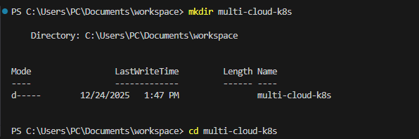

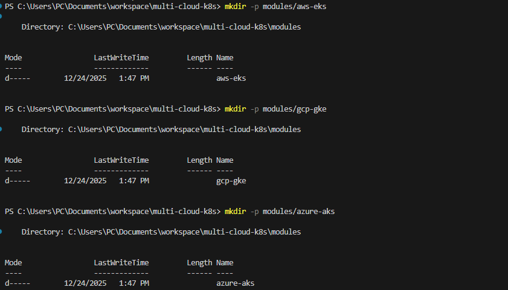

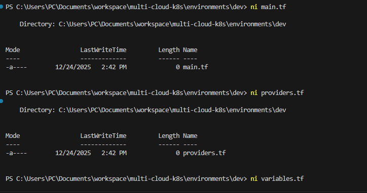

---

# AWS EKS Deployment

## Infrastructure Provisioned

Using Terraform, I created:
- AWS VPC and subnets
- IAM roles for EKS cluster and worker nodes
- EKS control plane
- Managed node group

The reusable AWS module was created inside:

```text
modules/aws-eks/
```

### AWS Terraform Module

```hcl
module "aws_eks" {
  source       = "../../modules/aws-eks"
  cluster_name = "dev-eks-cluster"
  region       = var.aws_region
  subnet_ids   = [
    "subnet-00d269bfe2a5c17f7",
    "subnet-0ebd983bc68309e5b"
  ]
}
```

---

## Terraform Initialization and Deployment

I initialized Terraform and applied the configuration to provision the EKS cluster.

```powershell
terraform init
terraform apply
```

### Screenshots
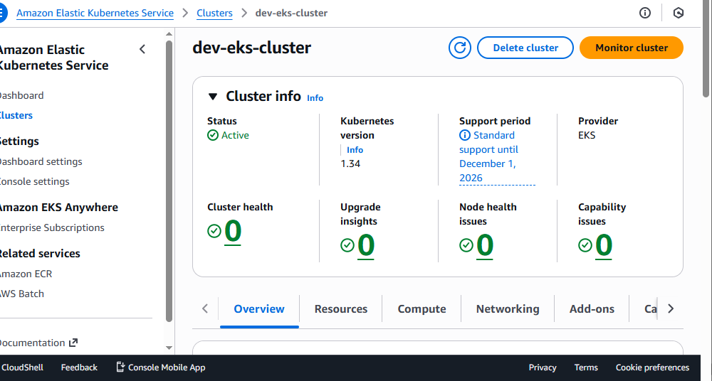

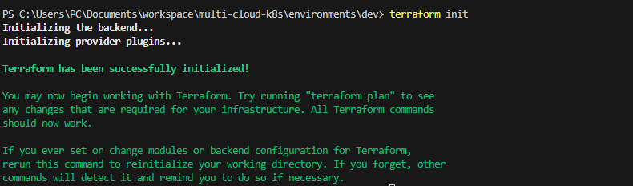

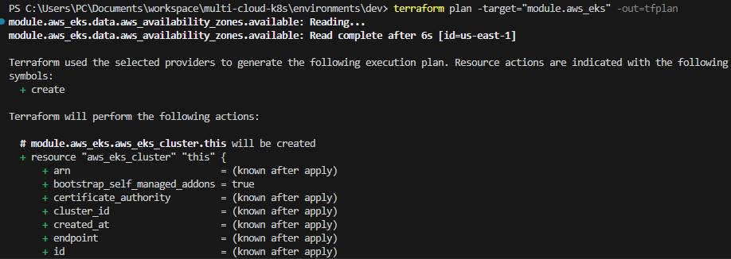

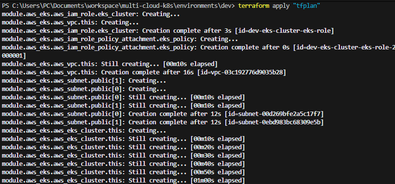

---

# GCP GKE Deployment

## Infrastructure Provisioned

I created a reusable Terraform module for GKE that provisions:
- Regional Kubernetes cluster
- Node pools
- Cluster configuration

The module was created inside:

```text
modules/gcp-gke/
```

### GCP Terraform Module

```hcl
module "gcp_gke" {
  source           = "../../modules/gcp-gke"
  gcp_project_id   = var.gcp_project_id
  gcp_region       = var.gcp_region
  gke_cluster_name = "dev-gke-cluster"
  gke_node_count   = 1
  gke_machine_type = "e2-medium"
  gke_disk_size_gb = 50
}
```

---

## Cluster Validation

After deployment, I authenticated kubectl against the GKE cluster and verified node availability.

```powershell
gcloud container clusters get-credentials dev-gke-cluster --region us-central1

kubectl get nodes -o wide
```

### Validation Output

```text
NAME                                             STATUS   ROLES   AGE
gke-dev-gke-cluster-default-pool-3a33dba5-k09z  Ready    <none>  17h
gke-dev-gke-cluster-default-pool-fe30095f-xhgs  Ready    <none>  17h
```

### Screenshots
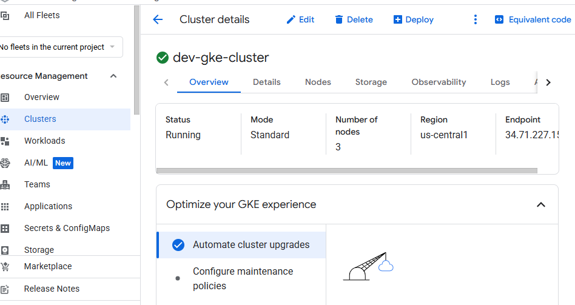

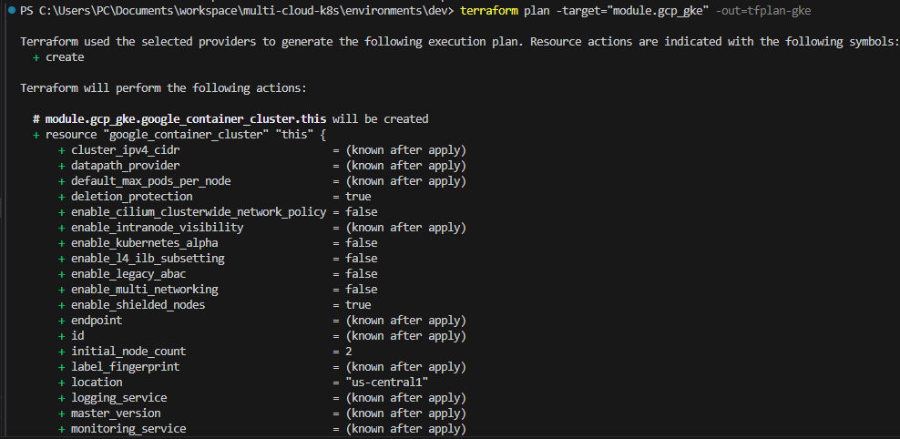

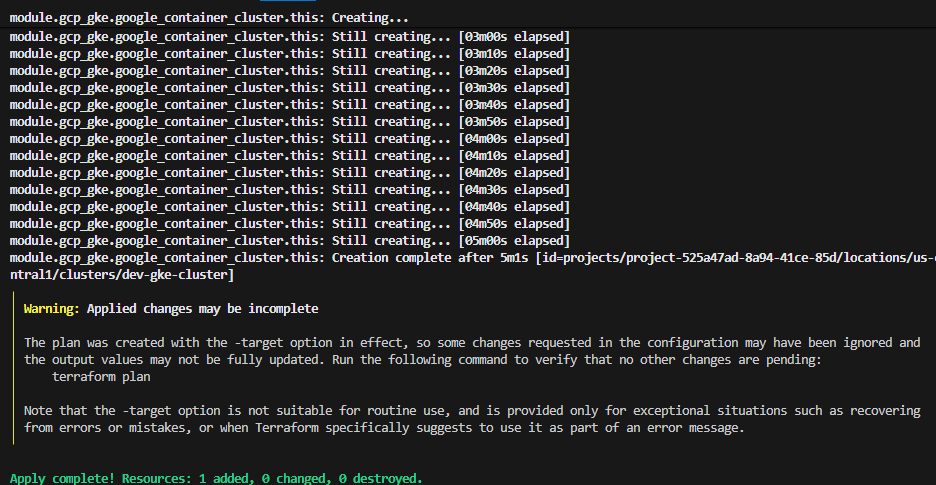

---

# Deploying the NGINX Application

## Kubernetes Deployment Manifest

I created a Kubernetes Deployment manifest with:
- 2 NGINX replicas
- Container port exposure
- Label selectors for service discovery

### deployment.yaml

```yaml
apiVersion: apps/v1
kind: Deployment
metadata:
  name: nginx-deployment
spec:
  replicas: 2
  selector:
    matchLabels:
      app: nginx
  template:
    metadata:
      labels:
        app: nginx
    spec:
      containers:
      - name: nginx
        image: nginx:latest
        ports:
        - containerPort: 80
```

---

## Kubernetes Service Manifest

I exposed the deployment using a LoadBalancer service.

### service.yaml

```yaml
apiVersion: v1
kind: Service
metadata:
  name: demo-app-service
spec:
  selector:
    app: nginx
  type: LoadBalancer
  ports:
  - port: 80
    targetPort: 80
```

---

## Deploying the Application

I applied the manifests to both AWS EKS and GCP GKE clusters.

```powershell
kubectl apply -f deployment.yaml
kubectl apply -f service.yaml

kubectl get pods
kubectl get svc
```

### Screenshots
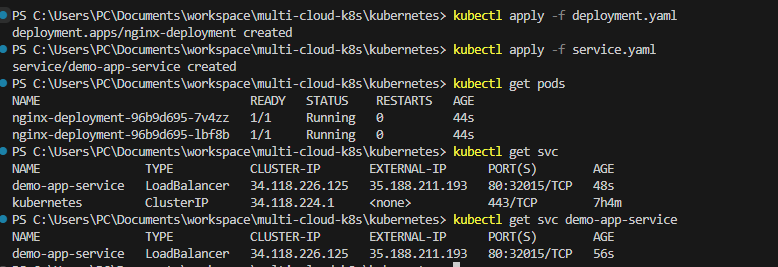

---

# Validation and Testing

## AWS EKS Validation

The NGINX application was successfully exposed through an AWS Elastic Load Balancer.

### AWS Service Endpoint

```text
a796be1bb6997444c937e20a6a25827c-1114439536.us-east-1.elb.amazonaws.com
```

---

## GCP GKE Validation

The GKE service was successfully exposed with an external IP.

### GCP Service Endpoint

```text
35.188.211.193
```

### Screenshots
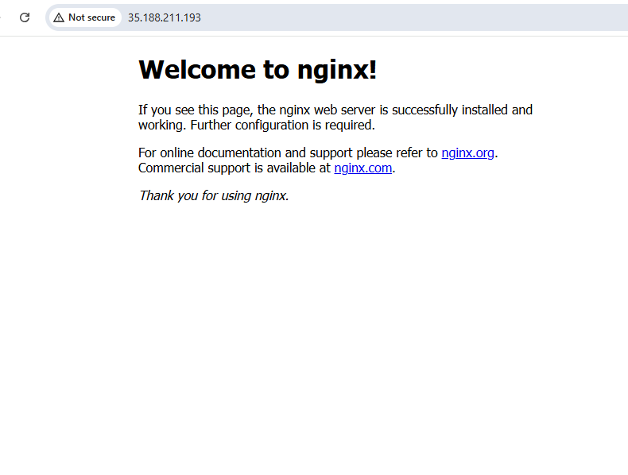

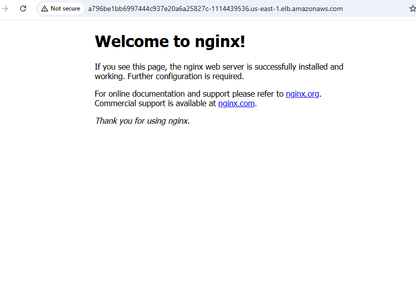

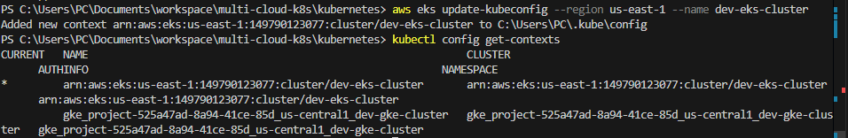

---

# Planned Azure AKS Integration

Azure AKS integration was included in the project architecture but was not implemented due to Azure account eligibility limitations.

The intended deployment process would have included:

```powershell
az aks get-credentials \
  --resource-group dev-aks-rg \
  --name dev-aks-cluster

kubectl config use-context <aks-context-name>

kubectl get nodes
```

---

# Planned Inter-Cluster Networking

The next planned phase was to interconnect AWS EKS and GCP GKE clusters using:
- VPN connectivity
- VPC peering
- Cross-cluster communication modules

This phase was not implemented due to:
- Additional cloud networking costs
- Increased infrastructure complexity

However, the architecture was intentionally designed to support future expansion.

### Screenshots
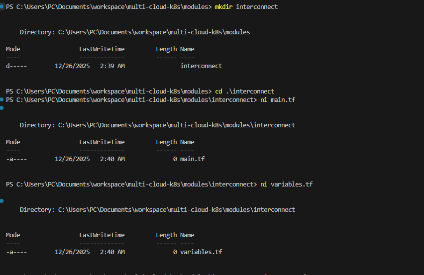

---

# Challenges and Lessons Learned

During this project, I encountered several practical infrastructure and cloud engineering challenges:

## Key Challenges
- Managing cloud authentication across multiple providers
- Structuring reusable Terraform modules correctly
- Handling Kubernetes context switching between clusters
- Ensuring service exposure worked consistently across providers
- Maintaining modular and reusable Infrastructure-as-Code design

## Key Learnings
- Improved understanding of multi-cloud Kubernetes architecture
- Gained hands-on experience with reusable Terraform module design
- Learned practical Kubernetes deployment validation workflows
- Strengthened troubleshooting skills across AWS and GCP environments
- Improved understanding of cloud-native scalability and infrastructure abstraction

---

# Outcome

By completing this project, I successfully:

- Built reusable Terraform modules for AWS EKS and GCP GKE
- Provisioned and validated Kubernetes clusters in multiple cloud environments
- Deployed containerized workloads consistently across providers
- Improved infrastructure consistency through modular Infrastructure-as-Code
- Demonstrated practical multi-cloud Kubernetes deployment capabilities

This project strengthened my practical DevOps and cloud engineering skills in:
- Terraform
- Kubernetes
- AWS EKS
- GCP GKE
- Infrastructure Automation
- Multi-cloud deployment architecture

---

# Repository

GitHub Repository:

https://github.com/BigOronaa/Terraform
